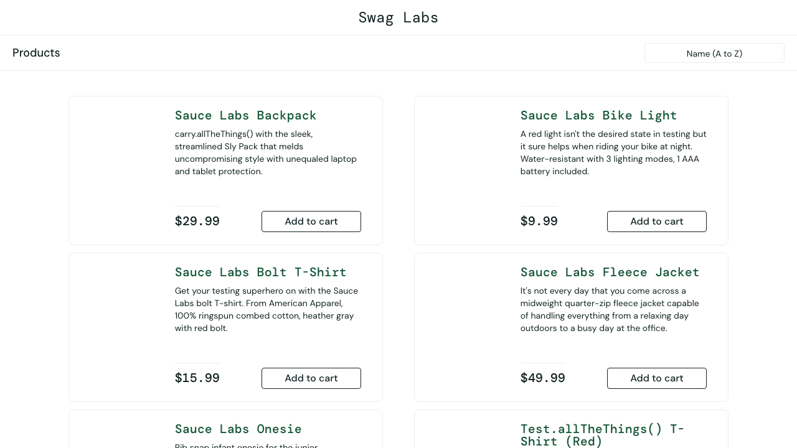

# BUG-001 — Ürün görselleri yanlış gösteriliyor

| Alan      | Detay |
|-----------|-------|
| **Severity** | High |
| **User**     | problem_user |
| **Status**   | Open |

## Steps to Reproduce

1. `https://www.saucedemo.com` adresine git
2. Username: `problem_user`, Password: `secret_sauce` ile giriş yap
3. `/inventory.html` sayfasındaki ürün görsellerini incele

## Expected

Her ürün kendine ait görseli göstermeli. standard_user ile görünen görseller ile aynı olmalı.

## Actual

Tüm ürünler aynı yanlış görseli gösteriyor (köpek fotoğrafı). Hiçbir ürün görseli standard_user ile eşleşmiyor.

## Related Test

`week-3/tests/e2e/bug-discovery/problem-user.spec.ts`
→ `BUG — ürün resimleri standard_user ile aynı olmalı`

## Screenshot

